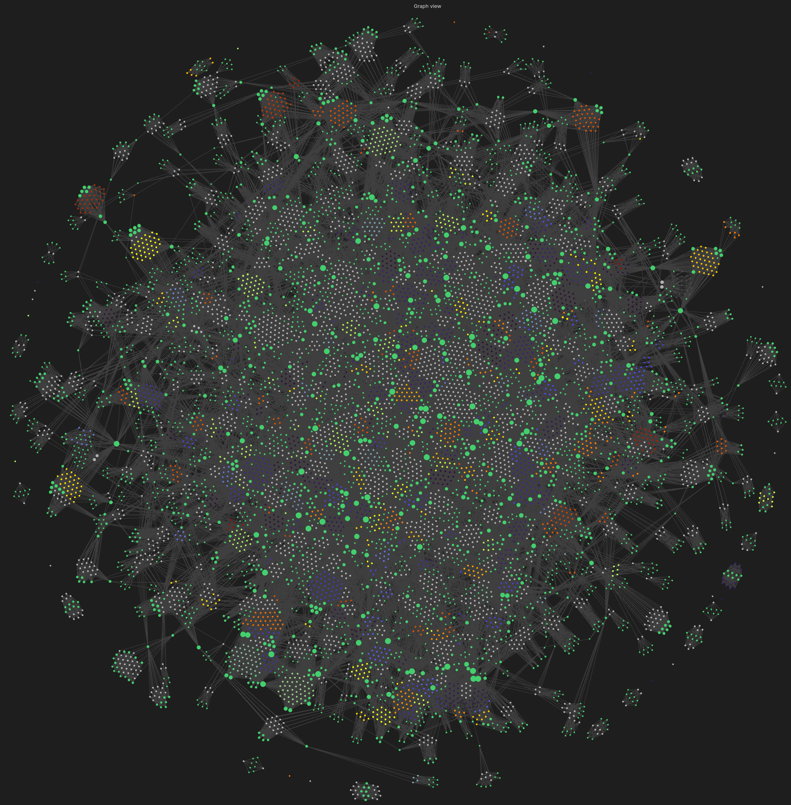

# AI Conversation History Converter



Convert your AI conversation history (Claude or ChatGPT) into an organized, searchable collection of markdown files.

## Features

- 📁 **Organized Structure** - Conversations organized by date (year/month/day)
- 📝 **Markdown Extraction** - Automatically detects and extracts markdown content
- 🏷️ **Smart Hashtags** - Uses TF-IDF analysis to generate relevant keyword hashtags
- 💻 **Code Extraction** - Code blocks saved as separate files with proper extensions
- 🔍 **Searchable Index** - JSON index files with keywords for easy discovery
- 📖 **Context-Rich Titles** - Each markdown file includes full conversation context
- 🎨 **Obsidian Graph Support** - Creates color-coded knowledge graphs with dual-layer grouping
- 🏷️ **Tag & File Pattern Analysis** - Interactive configuration for graph visualization

## Quick Start

### For Claude Users

1. **Export your Claude data**
   - Go to https://claude.ai/settings
   - Download your data (you'll get `conversations.json`, `projects.json`, and `users.json`)

2. **Clone this repository**
   ```bash
   git clone https://github.com/aaronsb/llmchat-knowledge-converter.git
   cd llmchat-knowledge-converter
   ```

3. **Copy your Claude export files to the input directory**
   ```bash
   cp ~/Downloads/conversations.json input/
   cp ~/Downloads/projects.json input/
   cp ~/Downloads/users.json input/
   ```

4. **Run the converter**
   ```bash
   # Show help and usage information
   ./convert_claude_history.sh
   
   # Convert with a custom directory name
   ./convert_claude_history.sh my_claude_archive
   ```

### For ChatGPT Users

1. **Export your ChatGPT data**
   - Go to https://chatgpt.com/gpts/mine
   - Click on your profile → Data controls → Export data
   - Download and extract the ZIP file

2. **Clone this repository**
   ```bash
   git clone https://github.com/aaronsb/llmchat-knowledge-converter.git
   cd llmchat-knowledge-converter
   ```

3. **Copy your ChatGPT conversations.json to the input directory**
   ```bash
   cp ~/Downloads/conversations.json input/
   ```

4. **Run the ChatGPT converter**
   ```bash
   # Show help and usage information
   ./convert_chatgpt_history.sh
   
   # Convert with a custom directory name
   ./convert_chatgpt_history.sh my_chatgpt_archive
   ```

Both converters will guide you through an interactive process to configure your conversion.

## Interactive Walkthrough

When you run `./convert_claude_history.sh my_claude_archive`, here's what happens:

### 1. File Detection
The script checks for your Claude export files and shows their sizes:
```
Found export files:
  ✓ input/conversations.json (82M)
  ✓ input/projects.json (1.1M)
  ✓ input/users.json (150)
```

### 2. Confirmation Prompt
You'll be asked to confirm before proceeding:
```
This will:
  1. Set up a Python virtual environment (if needed)
  2. Install required dependencies
  3. Process your Claude export files from input/
  4. Create organized markdown files in 'output/my_claude_archive/'

Do you want to proceed? (y/N):
```

### 3. Processing Phase
The script will:
- Create a Python virtual environment
- Install required packages (ijson, scikit-learn, nltk)
- Download language processing data
- Convert your conversations to markdown

### 4. Tag Analysis
After processing, you'll see comprehensive statistics:
```
TAG AND FILE PATTERN ANALYSIS COMPLETE
============================================================

TAG STATISTICS:
Total unique tags found: 3749
Tags after exclusion filter: 3442
...
```

### 5. Interactive Configuration
You'll be prompted to configure color groups for Obsidian:

**Tag Configuration:**
```
Include TAG color groups? (Y/n): y
Enter TAG water level (or press Enter for 30): 30
```

Then you'll see a beautiful color scheme menu with ANSI previews:
```
Available color schemes (with previews):
  1. rainbow       ████████████ - Full spectrum rainbow
  2. terrain       ████████████ - Green valleys → Brown mountains → White peaks
  3. ocean         ████████████ - Deep blue → Light blue → Aqua
  ...
Select TAG color scheme (1-12, or press Enter for ocean): 3
```

**File Pattern Configuration:**
```
Include FILE PATTERN color groups? (Y/n): y
Enter FILE PATTERN water level (or press Enter for 30): 30
Select FILE PATTERN color scheme (1-12, or press Enter for sunset): 4
```

### 6. Completion
Finally, you'll see:
```
CONVERSION COMPLETE!
Your knowledge base is ready in: ../output/my_claude_archive

To use with Obsidian:
1. Open Obsidian
2. Create new vault or open existing vault
3. Copy contents of output folder to your vault
4. Open Graph View to see your color-coded knowledge network!
```

## Understanding Water Levels

Water levels determine which tags/patterns get colored in your graph. The concept fits naturally with the statistical log(n) distribution of tag frequencies - in real-world data, you typically have a few very common tags and a long tail of less frequent ones.

- **Higher water level** = Fewer items colored (only most frequent)
- **Lower water level** = More items colored (including less frequent)
- **Default: 30** = Shows items with 30+ occurrences

This threshold aligns with the natural break point in a log distribution where the rate of change decreases significantly.

For example, with 3,749 total tags following a typical log distribution:
- Water level 100 → Shows ~26 most important tags (the peak)
- Water level 30 → Shows ~308 important tags (the sweet spot)
- Water level 10 → Shows ~1,272 somewhat important tags (includes the tail)

The default of 30 captures the "head" of the distribution - the tags that appear frequently enough to be meaningful patterns rather than noise.

## Project Structure

```
llmchat-knowledge-converter/
├── convert_claude_history.sh    # Claude conversion script
├── convert_chatgpt_history.sh   # ChatGPT conversion script
├── README.md                    # This file
├── input/                       # Place your export files here
│   ├── conversations.json       # From Claude or ChatGPT
│   ├── projects.json           # Claude only
│   └── users.json              # Claude only
├── output/                      # Converted files will appear here
│   └── your_output_name/        # Your conversion output
└── src/                         # Source code
    ├── convert_enhanced.py      # Claude conversion engine
    ├── convert_chatgpt.py       # ChatGPT conversion engine
    ├── converter_base.py        # Shared converter functionality
    ├── tag_analyzer.py          # Tag and file pattern analysis
    ├── color_previews.py        # ANSI color scheme previews
    ├── analyze_tags.py          # Comprehensive tag analysis tool
    ├── tag_exclusions.txt       # Common words to exclude from tags
    └── obsidian_templates/      # Obsidian configuration templates
```

## What You Get

Both Claude and ChatGPT converters produce the same output structure for compatibility:

```
output/your_output_name/
├── conversations/
│   └── 2024/
│       └── 03-March/
│           └── 15/
│               └── Your_Conversation_Title_abc123/
│                   ├── metadata.json
│                   └── messages/
│                       ├── 001_human_message.md
│                       ├── 002_assistant_message.md
│                       └── code_snippets/
│                           └── snippet_00.py
├── projects/
│   └── Your_Project_Name_xyz789/
│       ├── metadata.json
│       └── documents/
├── conversations_index.json
├── projects_index.json
├── users.json
├── tag_analysis_report.json
└── .obsidian/                   # Obsidian configuration
    └── graph.json               # Color-coded graph settings
```

## Requirements

- Python 3.6+
- Unix-like environment (Linux, macOS, WSL on Windows)

## Advanced Usage

### Using with Obsidian

The converted output is perfect for Obsidian:
1. Open Obsidian and create a new vault or use an existing one
2. Copy the contents of `output/claude_history/` to your vault
3. Enable the Graph View to see your knowledge network
4. Use the conversation tags to find all messages from a specific conversation

### Enhanced with Obsidian MCP Plugin

For an even more powerful experience, pair this converter with the [Obsidian MCP Plugin](https://github.com/aaronsb/obsidian-mcp-plugin):

The MCP (Model Context Protocol) plugin allows Claude to directly interact with your converted knowledge base:
- **Read and search** through your conversation history
- **Create new notes** that reference past conversations
- **Update existing notes** with insights from your Claude history
- **Build connections** between different conversations and topics

Together, these tools create a living knowledge system where your past conversations with Claude become an active, queryable resource for future interactions.

### Customizing the Conversion

You can modify `src/convert_enhanced.py` to:
- Change keyword extraction parameters
- Modify file naming conventions
- Add custom metadata fields
- Filter specific conversations

## License

MIT
