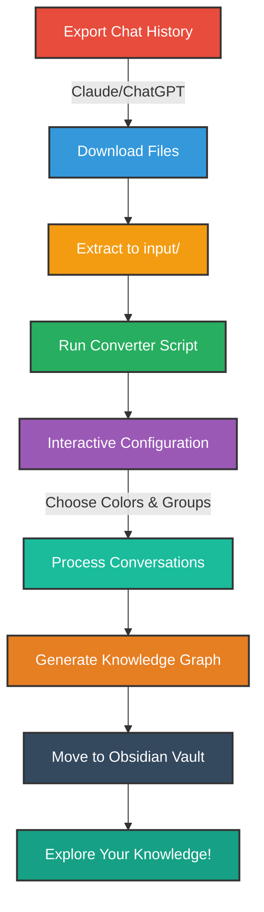
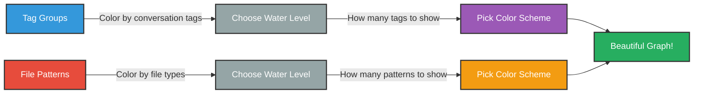

# LLM Chat Knowledge Converter 🧠


**Transform your AI conversations into a personal knowledge graph.**

This toolkit converts LLM chat exports (Claude, ChatGPT) into an interconnected knowledge base you can explore, search, and build upon. Your conversations with AI become a living library of insights, code snippets, and ideas - visualized as a knowledge graph in Obsidian.

## 🔗 Power Up with Obsidian MCP Plugin

Take your knowledge graph to the next level with the [Obsidian MCP Plugin](https://github.com/aaronsb/obsidian-mcp-plugin):

This companion tool lets Claude directly interact with your converted knowledge base:
- **Search and read** through your entire conversation history
- **Create new notes** that reference past discussions
- **Build connections** between different topics and conversations
- **Ask Claude questions** about your own knowledge graph

Together, these tools create a living knowledge system where your AI conversations become an active, searchable resource!

## 🎯 How It Works



## 🚀 Quick Start Guide

### Prerequisites
- A Mac, Linux, or Windows (with WSL) computer
- Basic familiarity with terminal/command line
- [Obsidian](https://obsidian.md/) installed (free note-taking app)

### Step 1: Get the Converter

Open your terminal and run:
```bash
git clone https://github.com/aaronsb/llmchat-knowledge-converter.git
cd llmchat-knowledge-converter
```

### Step 2: Export Your Chat History

<details>
<summary><b>📘 For Claude Users</b></summary>

1. Go to https://claude.ai/settings
2. Download your data export
3. You'll receive three files:
   - `conversations.json`
   - `projects.json`
   - `users.json`
</details>

<details>
<summary><b>📗 For ChatGPT Users</b></summary>

1. Sign in to ChatGPT
2. Click your profile icon (top right corner)
3. Click Settings → Data controls
4. Under "Export data" click Export
5. Click "Confirm export" on the confirmation screen
6. Check your email for the download link (expires in 24 hours!)
7. Download and unzip the file
</details>

### Step 3: Place Files in Input Folder

<details>
<summary><b>📘 For Claude Users</b></summary>

Copy all three JSON files into the `input/` folder:
```bash
cp ~/Downloads/conversations.json input/
cp ~/Downloads/projects.json input/
cp ~/Downloads/users.json input/
```
</details>

<details>
<summary><b>📗 For ChatGPT Users</b></summary>

Extract the entire ZIP contents into the `input/` folder:
```bash
unzip ~/Downloads/your-chatgpt-export.zip -d input/
```

This will extract:
- `conversations.json`
- Any images from DALL-E or uploads
- Other export data
</details>

### Step 4: Run the Converter

<details>
<summary><b>📘 For Claude Users</b></summary>

```bash
./convert_claude_history.sh my_claude_vault
```
</details>

<details>
<summary><b>📗 For ChatGPT Users</b></summary>

```bash
./convert_chatgpt_history.sh my_chatgpt_vault
```
</details>

The converter will:
1. ✅ Set up Python environment automatically
2. ✅ Ask you to confirm before proceeding
3. ✅ Process your conversations (may take a few minutes)
4. ✅ Ask about color grouping for visualization (just press Enter for defaults!)

### Step 5: Move to Your Obsidian Vault Location

**Important**: The output folder is in a temporary location. Move it to where you keep your Obsidian vaults:

```bash
mv output/my_claude_vault ~/Documents/ObsidianVaults/
```

### Step 6: Open in Obsidian

1. Open Obsidian
2. Click "Open folder as vault"
3. Select your moved folder
4. Click the Graph View button to see your knowledge network!

## 🎨 Interactive Configuration

During conversion, you'll customize how your knowledge graph looks:



### Water Levels Explained

Think of water levels like a filter - higher water = fewer items shown:
- **100** = Only the most common tags (top ~20)
- **30** = Balanced view (default, ~300 tags)
- **10** = Show many tags (~1000+)

## 📁 What Gets Created

```
your_vault_name/
├── 📅 conversations/              # Organized by date
│   └── 2024/
│       └── 03-March/
│           └── 15/
│               └── Your_Conversation/
│                   ├── 📄 metadata.json
│                   ├── 💬 messages/
│                   ├── 📝 markdown_files.md
│                   ├── 💻 code_snippets/
│                   └── 🖼️ images/
├── 📊 conversations_index.json    # Searchable index
└── ⚙️ .obsidian/                 # Graph settings
    └── graph.json
```

## 🌟 Why Use This?

Your AI conversations contain:
- **🔧 Solved Problems**: Technical solutions and debugging sessions
- **💻 Generated Code**: Scripts, functions, and examples  
- **💡 Creative Work**: Ideas, writing, and brainstorming
- **📚 Learning Notes**: Explanations and tutorials

This tool helps you:
- **💾 Preserve Knowledge**: Don't lose valuable insights
- **🔍 Discover Patterns**: See connections between topics
- **🏗️ Build on Past Work**: Reference previous solutions
- **🧠 Create a Second Brain**: Queryable knowledge repository

## ✨ Features

- 📁 **Smart Organization** - Date-based folder structure
- 🏷️ **Auto-Tagging** - TF-IDF keyword extraction
- 📝 **Markdown Extraction** - Preserves formatting
- 💻 **Code Extraction** - Separate files with syntax
- 🖼️ **Image Support** - Preserves DALL-E creations
- 🎨 **Visual Graphs** - Color-coded knowledge networks
- 🔍 **Full Search** - Find anything instantly

## 🛠️ Troubleshooting

<details>
<summary><b>❌ "No export files found" error</b></summary>

Make sure you've copied/extracted files to the `input/` folder. For ChatGPT, extract the entire ZIP contents, not just conversations.json.
</details>

<details>
<summary><b>❌ "Permission denied" error</b></summary>

Make the scripts executable:
```bash
chmod +x convert_*.sh
```
</details>

<details>
<summary><b>❌ Graph view looks empty</b></summary>

1. Enable Graph View in Obsidian settings
2. Check the filters in Graph View settings
3. Make sure you moved the vault folder (not left it in output/)
</details>

## 📋 Requirements

- Python 3.6 or higher
- Mac, Linux, or Windows with WSL
- About 2-3x your export size in free disk space

## 📚 Advanced Usage

<details>
<summary><b>Customization Options</b></summary>

- Edit `src/tag_exclusions.txt` to filter common words
- Modify color schemes in `src/tag_analyzer.py`
- Adjust keyword extraction in converter scripts
- Filter specific conversations by date or content
</details>

<details>
<summary><b>Batch Processing</b></summary>

Process multiple exports by creating separate output folders:
```bash
./convert_claude_history.sh claude_work_chats
./convert_claude_history.sh claude_personal_chats
```
</details>

## 📄 License

MIT - Feel free to modify and share!

---

*Built with ❤️ for the AI-assisted knowledge worker*